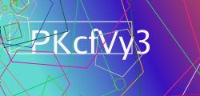

# captcha

## about

captcha is a basic package for creating/managing captchas, written entirely in Go. It allows the user to generate captchas on the fly using a random string generator and the gg library for rendering. /dev/shm is used as the workspace for these, as they should only live for a moment before the deferred cleanup function runs and deletes them.

The generator creates a gradient using random numbers for various parts to add some variation, writes the text to the image in a random-ish font color and then makes a random-ish number of iterations over the image adding random polygons - these should make it harder for machines to read the image.

## usage

usage is trivial, when you need a captcha for something you can generate a new Captcha with New(), then run Generate(), which will generate the captcha and write it to the disk. The location of the file can be accessed with the File() function. The Cleanup() function must always be run (and should typically be deferred so that it will run even if the function panics) unless you're using this to generate a bunch of captchas to store. the value of the captcha is in Text(), and can be used to validate the user input against the value of the captcha.

```go
captcha := captcha.New()
captcha.Generate()
defer captcha.Cleanup()
fmt.Println("the file is at", captcha.File(), "which means I can serve it with http.ServeFile or whatever.")
```

## product

this produces random captchas like the below:


